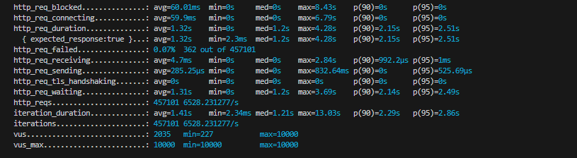
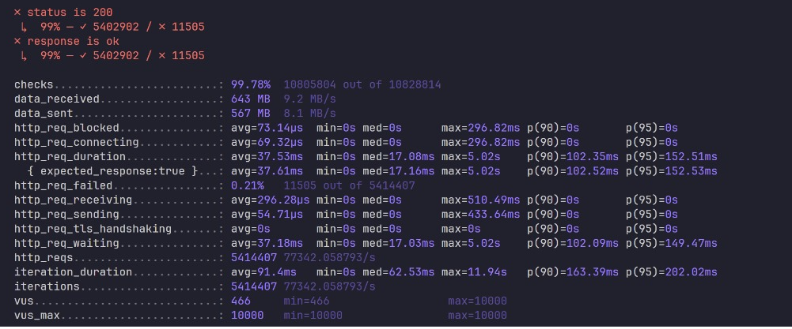
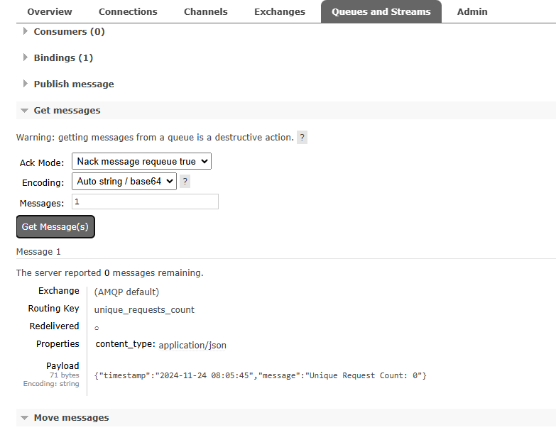

## Installation Guide

1.  Ensure that Docker & docker compose is set up on your local machine.
    Docker for Windows: [https://docs.docker.com/desktop/setup/install/windows-install/]
    Docker for Mac: [https://docs.docker.com/desktop/setup/install/mac-install/]
    Docker for Linux: [https://docs.docker.com/desktop/setup/install/linux/]<br>
    Docker Compose: [https://docs.docker.com/compose/install/]
    <br>
2.  Install Makefile
    Windows installation: `choco install make`
    <br>
3.  Install go
    [https://go.dev/doc/install]
    <br>
4.  Install K6 for load-testing
    Mac installation: `brew install k6`mak
    Linux installation: `sudo apt-get install k6`
    Windows installation: `choco install k6`

---

## Running in Development

1. Once docker is up and running, execute the make compose-up command. This will start all the required docker containers in the same network. As the verve-app depends on rabbitmq, it may take a few auto-retries to get the app container running.
```
make compose-up
```
<br>

2. Once the containers are running, you can view the API at localhost:8080/api/verve/accept?id=1 and view prometheus metrics at localhost:9090.
   <br>
3. To perform a load test, you can run the load-test_script.js file using k6. This will send requests from 100k virtual users over a minute. The RPS (requests per second) differs based on the CPU cores available. This API has been tested on 2 machines:

```
4 Cores: 457,101 requests made | 6528.231 RPS
```



```
14 Cores: 5,414,407 requests made | 77,342.058 RPS
```


<br>
4. To check the log stream, you can login to the RabbitMQ management console at localhost:15672. Using guest as username and password, go to the Queues and Streams tab, and you will be able to see the pushed log message every minute.
